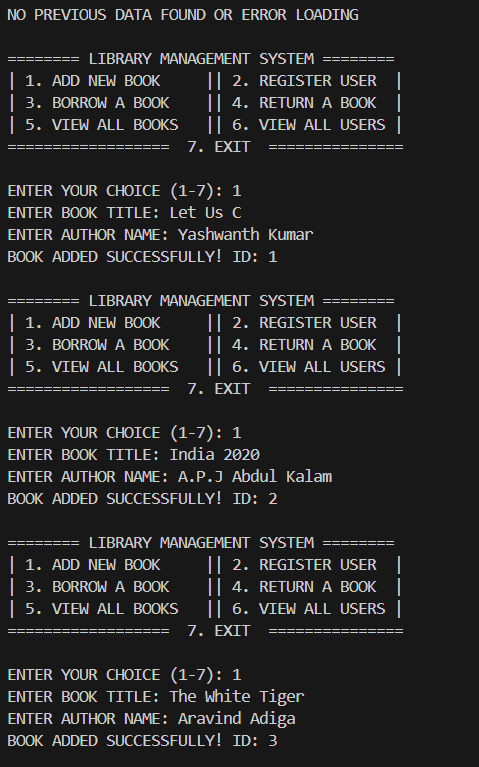
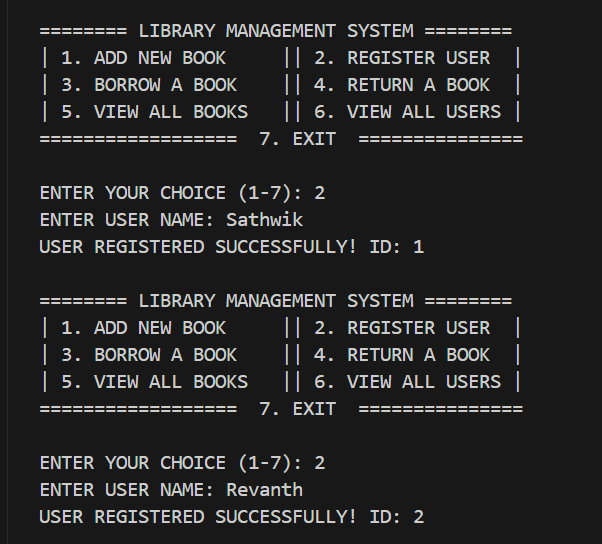
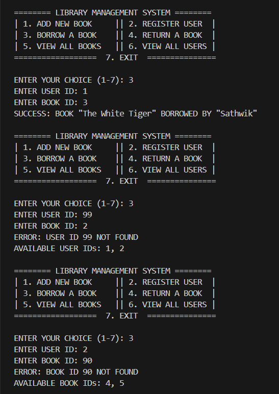
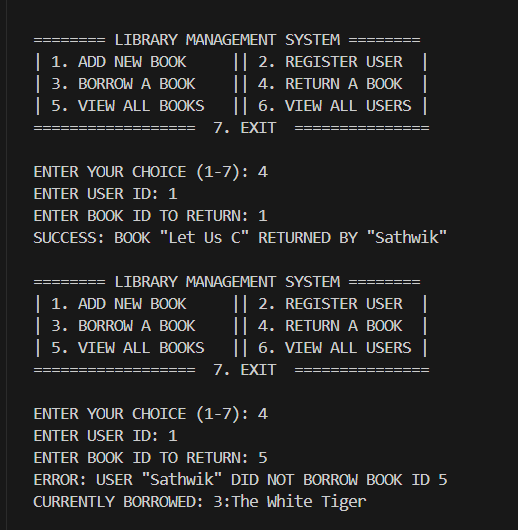
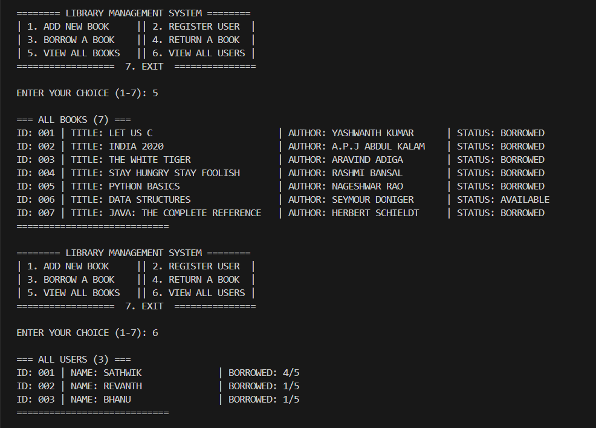
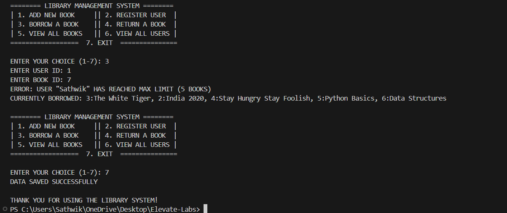

## 🏛️ Java Library Management System
A robust OOP-based console application for managing books, users, and transactions with persistent data storage.

## ✨ Features

## 📚 Core Operations
Book Management: Add/view books with auto-generated IDs

User System: Register users with 5-book borrowing limit

Transactions: Validate borrow/return operations

Search: Find books/users by ID

## 🛡️ Validation System
Input Checks: Non-empty strings, valid IDs

Transaction Rules:

Prevent over-borrowing (max 5 books/user)

Block duplicate borrows/returns

Error Recovery: Clear messages with retry prompts

## 💾 Data Persistence
Automatic save/load to library_data/ directory

Handles missing files gracefully

Uses Java Serialization for secure storage

## 🖥️ Demonstration 

| Screenshot | Description |
|------------|-------------|
|  | System initialization and adding first books with auto-generated IDs |
|  | Registering new users with unique IDs |
|  | Successful borrow transaction and error handling for invalid IDs |
|  | Returning books with validation (success & failure cases) |
|  | Formatted display of all books and users with status |
|  | Enforcement of 5-book borrowing limit per user |

## 🚀 How to Run

# Compile & Execute
javac *.java && java Main

## Sample Workflow:

text
> Enter choice (1-7): 1  
> BOOK TITLE: Atomic Habits  
> AUTHOR: James Clear  
✅ BOOK ADDED! ID: 8  

## 📜 OOP Implementation
Concept	Example
Encapsulation	protected setAvailable() in Book
Abstraction	FileHandler hides file operations
Polymorphism	Custom toString() for display
Inheritance	Serializable interface implemented
## 📝 License
MIT License - Free for academic/portfolio use.

-🔗 GitHub Repo:https://github.com/Sathwik-Samudrala/Library-Management-System.git
-📧 Contact: sathwik.samudrala915@gmail.com
